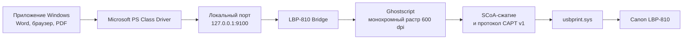

# Как заставить Canon LBP‑810 печатать в Windows 11

## История одного принтера, двух несовместимых эпох и небольшого моста между ними

Canon LBP‑810 — лазерный принтер начала 2000-х. Он исправен, подключается по
USB и умеет печатать вполне приличные страницы с разрешением 600 dpi. Но его
последний официальный драйвер рассчитан на 32-битные Windows Vista и Windows 7.

На первый взгляд проблема выглядит просто: «Windows 11 не принимает старый
драйвер». На практике за этой фразой скрываются сразу несколько разных задач:

1. понять, можно ли как-то загрузить оригинальный драйвер;
2. выяснить, что именно принтер ожидает получить по USB;
3. научить современные приложения Windows формировать подходящие задания;
4. преобразовать эти задания в язык принтера;
5. сделать всё это достаточно надёжным, чтобы оно работало как обычный принтер,
   а не как лабораторный эксперимент.

В результате получился не новый драйвер ядра Windows, а пользовательский
**мост печати**. С точки зрения пользователя после установки это обычная
очередь `Canon LBP-810`. Внутри происходит довольно занятное путешествие:



Ниже — как мы к этому пришли.

---

## 1. Почему нельзя было просто «допилить INF»

Первым делом был распакован официальный установщик
`LBP-810_R110_V110_Win_x32_EN_7.exe`.

Внутри находился нормальный драйверный пакет своего времени: INF-файл,
каталог с подписью, DLL, EXE и SYS. Но проверка исполняемых файлов показала,
что **все они собраны для архитектуры x86**. В INF также присутствуют только
секции вида `Canon.NTx86`.

Это важно: проблема не в номере версии Windows и не в том, что установщик
показывает предупреждение. 64-битная подсистема печати Windows не может
загрузить 32-битную DLL драйвера в свой 64-битный процесс. Режим совместимости
здесь ничего не меняет: он может подправить поведение старой программы, но не
превращает машинный код x86 в x64.

Можно изменить INF и написать там `NTamd64`, но это будет примерно как
переклеить на вилке наклейку «220 В» и ожидать, что изменится электрическая
схема. Windows увидит другое название секции, но внутри останется тот же
32-битный код.

Microsoft тоже разделяет драйверы печати по архитектуре и рекомендует для
x64-систем использовать совместимый 64-битный драйвер:
[поиск совместимого драйвера печати для 64-битной Windows](https://learn.microsoft.com/en-us/troubleshoot/windows-server/printing/find-compatible-printer-driver-64-bit).

Значит, оригинальный драйвер можно оставить как исторический артефакт, но
использовать его код напрямую нельзя.

---

## 2. Хорошая новость: Windows прекрасно видит сам принтер

Отсутствие фирменного драйвера не означает, что USB-устройство невидимо.
Windows 11 определила его через штатный системный драйвер `usbprint.sys`:

```text
USB\VID_04A9&PID_260A
MFG:Canon;
MDL:LBP-810;
CMD:CAPT;
VER:1.0;
CLS:PRINTER;
DES:Canon LBP-810
```

Здесь уже содержится половина ответа:

- `VID_04A9` — идентификатор Canon;
- `PID_260A` — конкретно LBP‑810;
- `CMD:CAPT` — принтер принимает не PCL и не обычный PostScript, а Canon CAPT;
- `VER:1.0` — первое поколение протокола.

Windows предоставляет пользовательским программам интерфейс
`GUID_DEVINTERFACE_USBPRINT`. Через него можно:

- открыть принтер как файл с помощью `CreateFile`;
- получить IEEE‑1284 Device ID;
- прочитать параллельный статус;
- выполнить мягкий сброс;
- читать и записывать данные USB-принтера.

Это документированный системный путь:
[USBPRINT programming considerations](https://learn.microsoft.com/en-us/windows-hardware/drivers/print/programming-considerations-for-usbprint) и
[IOCTL_USBPRINT_GET_1284_ID](https://learn.microsoft.com/en-us/windows-hardware/drivers/ddi/usbprint/ni-usbprint-ioctl_usbprint_get_1284_id).

То есть нам не пришлось заменять `usbprint.sys`, отключать проверку подписей
или устанавливать неизвестный драйвер ядра. Современная Windows уже умеет
надёжно передавать байты по USB. Оставалось понять, **какие именно байты**
нужны LBP‑810.

---

## 3. Что такое CAPT и почему принтеру нельзя отправить PDF

Многие принтеры понимают стандартные языки вроде PCL или PostScript. LBP‑810
устроен иначе: это так называемый host-based printer.

Сам принтер относительно простой. Большую часть работы делает компьютер:

1. превращает документ в чёрно-белое растровое изображение;
2. формирует параметры страницы;
3. сжимает строки изображения;
4. управляет состоянием принтера;
5. передаёт готовый видеопоток.

Canon называет этот протокол **CAPT — Canon Advanced Printing Technology**.
Для первого поколения используется растровое сжатие **SCoA**.

Если отправить в USB обычный PDF, текстовый файл или PostScript, принтер не
поймёт содержимое. Ему нужна последовательность пакетов примерно такого
смысла:

```text
зарезервировать устройство
перейти online для страницы 0
начать страницу A4
начать видеоданные
передать блок SCoA
передать следующий блок SCoA
закончить страницу
дождаться физической печати
перейти offline
освободить устройство
```

К счастью, протокол уже был исследован сообществом. Проекты
[libcapt](https://github.com/darkvision77/libcapt) и
[captppd](https://github.com/darkvision77/captppd) реализуют CAPT v1,
SCoA и прямо указывают LBP‑810 среди поддерживаемых моделей.

`libcapt` отвечает за пакеты протокола и компрессию. `captppd` добавляет
логику настоящего задания печати: ожидание готовности, повтор страницы,
статусы бумаги, переходы online/offline и обработку ошибок.

Исходно эти проекты предназначены для Linux/CUPS и работают через libusb.
Мы взяли независимую от ОС протокольную часть, а USB-транспорт написали заново
для Windows поверх `usbprint.sys`.

---

## 4. Почему это называется мостом

У нас образовались два мира:

- современная Windows умеет печатать из любых приложений, но ничего не знает
  о CAPT v1;
- принтер понимает CAPT v1, но ничего не знает о современных документах.

Мост переводит данные между ними.

### Левая сторона моста: обычная очередь Windows

Создавать собственный классический драйвер печати Windows было бы возможно,
но это означало бы отдельный INF, пакет драйвера, подпись и интеграцию с
внутренним конвейером печати. Для маленького независимого проекта это много
сложности и потенциально опасного системного кода.

В Windows уже есть подписанный 64-битный драйвер
`Microsoft PS Class Driver`. Он умеет принять задание от Word, браузера или
PDF-просмотрщика и сформировать стандартный PostScript.

Мы создаём очередь:

```text
Имя:       Canon LBP-810
Драйвер:   Microsoft PS Class Driver
Порт:      CanonLBP810_CAPT
Адрес:     127.0.0.1:9100
```

Для Windows это как будто сетевой PostScript-принтер. Но адрес loopback
означает «этот же компьютер». В сеть ничего не публикуется.

### Середина моста: локальная служба

Служба `CanonLBP810Bridge` слушает только `127.0.0.1:9100`. Она:

1. принимает RAW-задание от очереди Windows;
2. находит начало PostScript `%!PS`;
3. сохраняет временный spool-файл;
4. запускает Ghostscript в скрытом режиме;
5. получает одну или несколько PBM-страниц;
6. передаёт страницы CAPT-части;
7. удаляет временные файлы после успеха.

Для защиты от случайно огромного задания установлен предел 512 MiB.
Ghostscript запускается с `-dSAFER`, а TCP-сервер не доступен извне.

### Правая сторона моста: растр, SCoA и USB

Ghostscript рендерит PostScript в формат PBM P4 — простой чёрно-белый растр.
Для страницы A4 при 600 dpi получилось:

```text
4958 × 7017 пикселей
около 4,35 MB несжатых данных
```

Ширина дополняется до целого числа байт, высота выравнивается под требования
CAPT. Модуль `PbmRaster` определяет формат бумаги, при необходимости
поворачивает landscape-страницу и формирует:

```text
PaperSize    = A4
Resolution   = 600 dpi
PaperWidth   = 4960
PaperHeight  = 7014
MarginTop    = 1
TonerDensity = normal
```

Далее SCoA использует сходство соседних строк. У лазерной страницы много
белого пространства, одинаковых областей и повторяющихся пикселей, поэтому
растр хорошо сжимается.

В финальном тесте стандартная страница Windows прошла такие стадии:

```text
PostScript от Windows:      103 333 байта
PBM после Ghostscript:    4 350 606 байт
SCoA/CAPT в USB:             86 894 байта
Блоков CAPT:                         3
```

После передачи контроллер сообщил:

```text
Start=1
Printing=1
Shipped=1
Printed=1
```

Это уже не «команда успешно отправлена». `Printed=1` приходит от самого
контроллера LBP‑810 и означает, что физическая страница прошла механизм.

---

## 5. Самая полезная ошибка: замятая бумага

Первый полноценный тест выглядел подозрительно. Мост открывал принтер,
формировал страницу и писал:

```text
INFO: Writing page 1
```

После этого процесс мог ждать бесконечно.

Сначала это было похоже на ошибку USB или CAPT. Поэтому в обмен добавили:

- 15-секундные таймауты USB-операций;
- логирование статуса буфера изображения;
- прогресс передачи CAPT-блоков;
- отдельный таймаут физического завершения страницы;
- автоматическую команду `DISCARD_DATA` перед новым заданием;
- очистку восстановимых CAPT-ошибок.

Лог показал:

```text
basic status=0x08
IM_DATA_BUSY
```

Принтер считал буфер старого незавершённого задания занятым. После
`DISCARD_DATA` он принял все три блока. Затем появилось уже другое состояние:

```text
Engine=0x0140
media-jam
```

Программную часть `MIS_PRINT` удалось сбросить командой CAPT, а физический бит
`JAM` остался. Это был важный результат: мост не просто отправлял байты куда-то
в USB — он вёл настоящий двусторонний разговор с контроллером.

После извлечения замятой бумаги и перезапуска принтера тестовая страница
напечаталась, а счётчики дошли до `Printed=1`.

Иногда лучший интеграционный тест — это реальная механическая неисправность,
которую программа должна не скрыть, а точно назвать.

---

## 6. Как мост стал обычной программой для установки

Лабораторный EXE в папке разработчика — ещё не продукт.

Для нормального использования были добавлены:

- служба Windows с автоматическим запуском;
- журнал в `ProgramData`;
- установщик с запросом UAC;
- автоматическая проверка USB VID/PID;
- создание подписанной очереди Windows;
- сценарий удаления;
- сценарий печати тестовой страницы;
- переносимый Ghostscript runtime;
- лицензии сторонних компонентов.

После установки рабочие файлы находятся здесь:

```text
C:\Program Files\Canon LBP-810 Bridge
```

Журнал:

```text
C:\ProgramData\Canon LBP-810 Bridge\spool\bridge.log
```

Для релиза не нужна гигабайтная среда MSYS2. Сборщик пакета рекурсивно читает
таблицы импорта PE-файлов Ghostscript и копирует только реально необходимые
DLL. Получилось:

```text
29 файлов EXE/DLL Ghostscript
253 файла во всём пакете
41,51 MiB после распаковки
19,79 MiB в ZIP
```

ZIP был проверен не только на наличие файлов. Его версия была установлена в
`Program Files`, служба запущена именно оттуда, после чего стандартная страница
Windows снова дошла до `Printed=1`.

---

## 7. Что в итоге было написано

В проекте появились несколько отдельных слоёв.

### `WindowsUsbPrinter`

Windows-реализация транспорта:

- перечисление `GUID_DEVINTERFACE_USBPRINT`;
- выбор именно LBP‑810 по IEEE‑1284 ID;
- overlapped I/O;
- таймауты и отмена зависших операций;
- soft reset;
- потоковый `std::streambuf` поверх USB.

### `PbmRaster`

Адаптер между PBM и CAPT:

- разбор P4;
- проверка размеров;
- сопоставление A4, A5, Letter и других форматов;
- поворот landscape;
- выравнивание растра;
- параметры CAPT-страницы.

### `BridgeServer`

Локальный конвейер печати:

- RAW TCP на loopback;
- spool-файлы;
- запуск Ghostscript;
- многостраничные задания;
- очистка временных данных;
- защита от слишком больших заданий.

### `WindowsService`

Обёртка службы Windows:

- старт и остановка через Service Control Manager;
- автоматический запуск;
- корректное закрытие listener socket;
- постоянный диагностический журнал.

### Release scripts

Установка без среды разработки:

- копирование в `Program Files`;
- создание службы, порта и очереди;
- проверка физически подключённого LBP‑810;
- удаление всех установленных компонентов;
- формирование автономного ZIP.

---

## 8. Что здесь особенно приятно с инженерной точки зрения

Мы не пытались обмануть Windows и не тащили в систему древний неподходящий
драйвер.

Каждый слой делает то, что умеет лучше всего:

- Windows отвечает за приложения, очередь, PostScript и штатный USB-драйвер;
- Ghostscript отвечает за качественный растр;
- libcapt/captppd отвечают за исследованный протокол Canon;
- небольшой Windows-мост соединяет эти готовые части.

Это классический приём совместимости: когда две системы не говорят на одном
языке, необязательно переписывать одну из них. Иногда достаточно построить
хорошо наблюдаемый и надёжный переводчик.

---

## 9. Ограничения и дальнейшие шаги

Текущая версия намеренно узкая:

- Windows 11 x64;
- Canon LBP‑810 с `VID_04A9/PID_260A`;
- USB-подключение;
- монохромная печать 600 dpi;
- основной проверенный формат — A4.

Полезные будущие улучшения:

- нормальное окно статуса вместо чтения лога;
- уведомления Windows о бумаге, крышке и замятии;
- выбор плотности тонера и типа бумаги;
- автоматические обновления;
- подписанный установщик;
- CI-сборка GitHub Release;
- тесты на других CAPT v1 моделях.

Отдельный вопрос — лицензирование публичного бинарного пакета. Ghostscript
распространяется по AGPLv3. Artifex отдельно предупреждает, что приложение,
поставляемое вместе с AGPL Ghostscript, должно соблюдать условия AGPL либо
использовать коммерческую лицензию:
[Ghostscript FAQ](https://ghostscript.com/faq/index.html).

Поэтому полный исходный код этого проекта опубликован под AGPLv3-or-later
рядом с бинарным релизом:
[github.com/jellybebra/canon-lbp810](https://github.com/jellybebra/canon-lbp810).

---

## Финал

Снаружи результат выглядит почти скучно:

```text
Настройки → Принтеры → Canon LBP-810 → Печать
```

Но за этой строкой теперь стоит целая цепочка из Windows Spooler, PostScript,
локального TCP, Ghostscript, PBM, SCoA, CAPT и USB.

Принтер 2001 года не стал внезапно современным. Мы просто дали ему переводчика,
который понимает обе эпохи.
